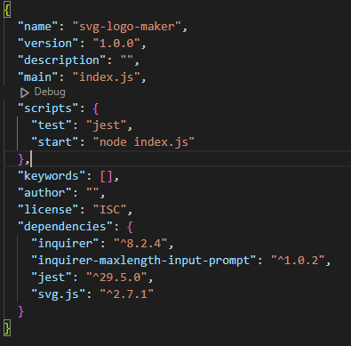
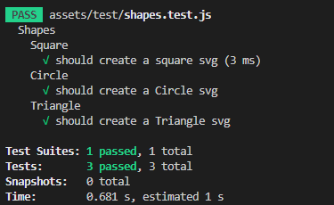

# SVG-Logo-Maker

## Description

If you have always wanted to created simple SGV logo, look no more. This is the app for you.
Using command line input, you cna create simple SVG logos.

## Table of Contents (Optional)

If your README is long, add a table of contents to make it easy for users to find what they need.

- [Installation](#installation)
- [Usage](#usage)
- [Credits](#credits)
- [License](#license)

## Installation

Remember to install all packages using 
```console
npm install
```
and confirm that the value of "test" is "jest".


## Usage

Once on all packages have been installed simply run the index.js in the terminal
```console
node ./index.js
```
Follow the prompt to create your very own SVG Logo


## Tests

This app feature a Jest test.
Simply run the test command in the terminal to ensure the app is rendering the expected logo.
```console
npm test
```
